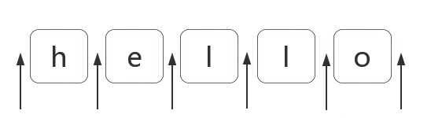

# 正则表达式通关秘籍

我相信正则表达式一直是困扰很多程序员的一门技术，但它的使用范围非常广泛，尤其在表单校验这个场景下更是不可或缺，同时它也能从侧面反映一个程序员的编程能力，所以，希望这篇文章能帮大家理清思路，真正搞懂正则表达式，让我们的开发效率得到较大的提升。

首先请记住一句话，正则表达式是模糊匹配模式，要么匹配字符，要么匹配位置。

## 一、正则表达式匹配字符串攻略

正则表达式的对字符串的匹配无非就是字符组、量词和分支结构的组合使用，掌握好这三个知识，大部分的字符串匹配都能解决。

字符组，类似这样 [abc] ，表示匹配一个字符，它可以是'a'，'b'，'c'之一。

```javascript
var string = 'a1c a2c a3c a4c';
var regex = /a[123]c/g;
var result = string.match(regex); // => [ 'a1c', 'a2c', 'a3c' ]
```

如果匹配的字符可以是任何字符，但就不能是'a'，'b'，'c'，可以写成[^abc]，用脱字符'^'表示求反，这种方式叫排除字符组。

如果字符组的字符特别多，比如这样[123456abcdefABCDEF]，可以写成[1-6a-fA-F]，用连词符'-'来省略和简写。

有了字符组的概念后，一些常见的字符组简写形式我们就能理解了。

```
\d 就是[0-9]，表示该字符是一个 0 到 9 的任意数字
\D 就是[^0-9]，表示该字符是一个 0 到 9 以外的字符
\w 就是[0-9a-zA-Z_]，表示该字符是一个 0 到 9、大小写字母或下划线的字符，也称单词字符
\W 就是[^0-9a-zA-Z_]，表示该字符不是一个单词字符
\s 就是[ \t\v\n\r\f]，表示该字符是一个空白符
\S 就是[^ \t\v\n\r\f]，表示该字符是一个非空白符
.  就是[^\n\r\u2028\u2029]，表示该字符是一个除了换行符、回车符、行分隔符和段分隔符以外的任意字符，也称通配符
```

量词也称重复，类似这样 {m,n} ，表示匹配的字符连续出现至少 m 次，最多 n 次。

```javascript
var string = '123 1234 12345 123456';
var regex = /\d{2,5}/g;
var result = string.match(regex); // => [ '123', '1234', '12345', '12345' ]
```

仔细分析上面例子，会发现每次匹配数字时，正则都是尽量多的匹配，比如在匹配到第一个连续的数字'123'时，它拿到的就是'123'，为什么不是'12'呢，从这里可以看出使用量词匹配时，正则是贪婪匹配的，如果要优先匹配 2 个数字字符，该怎么办呢，这时候就可以使用惰性匹配，只需要在量词后加一个字符'?'即可：

```javascript
var string = '123 1234 12345 123456';
var regex = /\d{2,5}?/g;
var result = string.match(regex); // => [ '12', '12', '34', '12', '34', '12', '34', '56' ]
```

一些常见的量词简写形式和惰性匹配情形如下：

```
{m,} 表示至少出现m次
{m}  等价于 {m,m} ，表示出现m次
?    等价于 {0,1} ，表示出现或不出现
+    等价于 {1,} ，表示至少出现一次
*    等价于 {0,} ，表示出现任意次

{m,n}?
{m,}?
??
+?
*?
```

通过量词和字符组，我们分别能实现字符串的横向模糊匹配和纵向模糊匹配，但是很多情况下，我们还需要用到分支结构，类似这样 (p1|p2|p3) ，表示匹配 p1、p2、p3 这三个子模式中的一个。

```javascript
var string = 'apples';
var regex1 = /apple|apples/g;
var regex2 = /apples|apple/g;
var res1 = string.match(regex1); // => [ 'apple' ]
var res2 = string.match(regex2); // => [ 'apples' ]
```

上例中，我们可以看到分支结构的匹配也是惰性的，前面的子模式匹配上，后面就不在尝试了。

至此，字符组、量词和分支结构的知识就介绍完了，下面找几个习题练习下，加深正则表达式对匹配字符串的理解：

```javascript
//有这样一个字符串'abc?*^&'，要求得到所有字符组成的数组
const getAllChat = (str) => {
    // ...... 代码省略 ......
};

//有这样一个16进制的颜色字符串'#ffbbad #Fc01DF #FFF #ffE #ffd2'，要求得到所有的颜色组成的数组
const getAllColor = (str) => {
    // ...... 代码省略 ......
};

//有这样的一些字符串'23:59','02:07','2:7','2:68'，它们都是24小时制的时间，判断它们是否是正确的时间
const checkTime = (str) => {
    // ...... 代码省略 ......
};

//要求判断日期字符串'2023-06-16'、'2023-6-6'、'2022-12-35'是否是正确的日期
const checkDay = (str) => {
    // ...... 代码省略 ......
};

//有这样一个window操作系统文件路径的字符串'F:\study\javascript\regex\regular expression.pdf'，判断其是否正确
const checkPath = (str) => {
    // ...... 代码省略 ......
};

//有这样一个html标签的字符串'<div id="container" class="main"></div>'，要求提取出id="container"
const getId = (str) => {
    // ...... 代码省略 ......
};
```

[本章所有示例和习题答案](./regex-1.js)

## 二、正则表达式位置匹配攻略

正则表达式匹配位置时，一般用于修改字符串，那位置是什么呢？可以把位置理解成空字符，如下箭头所指的地方：



在 es5 中，共有 6 个锚字符：

```
^ 脱字符，表示字符串开头，理解成字符串开头的空字符
$ 美元符，表示字符串的结尾，理解成字符串结尾的空字符
\b 单词边界，具体就是\w与\W、\w与^、\w与$之间的位置
\B 非单词边界，具体就是\w与\w、\W与\W、\W与^、\W与$之间的位置
(?=p) 正向先行断言，其中p是一个子模式，表示p前面的位置
(?!p) 负向先行断言，p也是一个子模式，表示除了p前面位置的所有位置
```

正则表达式对位置的匹配其实蛮简单的，掌握了上面 6 个锚字符就可以解决大部分位置匹配的问题了，下面直接进入习题练习，加深对位置匹配的理解：

```javascript
//写一个正则表达式，要求不配任何东西
const notMatch = (str) => {
    // ...... 代码省略 ......
};

//写一个正则，将数字类型的字符串变为千位分隔符表示，比如"12345678 123456789"变为"12,345,678 123,456,789"
const toThousands = (str) => {
    // ...... 代码省略 ......
};

//验证密码，密码长度6-12位，由数字、小写字母和大写字母组成，但必须至少包括2种字符
const checkPassword = (str) => {
    // ...... 代码省略 ......
};
```

[本章所有习题答案](./regex-2.js)

## 三、正则表达式括号的作用

正则表达式中的括号只有这两种情况：()和[]。[]表示字符组，很简单，本章主要介绍()的作用，前面我们知道它可以提供子表达式的所有可能，但是它还有一些另外的用法，分为捕获型分组、非捕获型分组。

```javascript
//将yyyy-mm-dd格式，替换成mm/dd/yyyy
var string = '2023-06-16';
var regex = /^(\d{4})-(\d{2})-(\d{2})$/g;
var result = string.replace(regex, '$2/$3/$1');
```

在这个例子中，首先是给年、月、日对应的字符串增加了()，这叫分组。

在 js 字符串的 replace 方法里，通过'$1'、'$2'、'$3'提取对应的年、月、日字符串，这叫引用分组，当然引用方式不止这一种，还有如下两种方式：

```javascript
//将yyyy-mm-dd格式，替换成mm/dd/yyyy
var string = '2023-06-16';
var regex = /^(\d{4})-(\d{2})-(\d{2})$/g;
var result = string.replace(
    regex,
    () => `${RegExp.$2}/${RegExp.$3}/${RegExp.$1}`
);

//将yyyy-mm-dd格式，替换成mm/dd/yyyy
var string = '2023-06-16';
var regex = /^(\d{4})-(\d{2})-(\d{2})$/g;
var result = string.replace(
    regex,
    (match, year, month, day) => `${month}/${day}/${year}`
);
```

分组除了能使用相应的 API （比如上例中的 replace 方法）引用分组外，还能在正则表达式里引用之前的分组，这叫反向引用，如下示例：

```javascript
//有三个这样的日期字符串'2023-06-16'、'2023.06.16'、'2023/06/16'，写一个正则匹配这样的字符串
var regex = /^\d{4}(\/|\-|\.)\d{2}\1\d{2}$/;
console.log(
    regex.test('2023-06-16'), // => true
    regex.test('2023.06.16'), // => true
    regex.test('2023/06/16'), // => true
    regex.test('2023-06/16') // => fasle
);
```

这里使用\1，引用了正则里之前的分组(\/|\-|\.)，保证前后分隔符是一致的。

注意：上例中的'\1'可以是任何正整数，如果不存在分组，就匹配反向引用的字符本身。

有时候我们会看到括号嵌套的情况，此时的反向引用顺序以左括号为准，如下：

```javascript
var regex = /^((\d)(\d(\d)))\1\2\3\4$/;
var string = '1231231233';
regex.test(string);
console.log(RegExp.$1, RegExp.$2, RegExp.$3, RegExp.$4); // => 123 1 23 3
```

上文中出现的分组，都可以捕获它们匹配的数据，以便后续引用，因此也称它们为捕获型分组。

如果只想要括号最原始的功能，只有分组，不能被引用，此时可以使用非捕获型分组(?:p)，p 表示一个子模式。

正则表达式中括号的作用介绍完了，下面进入习题练习，加深理解：

```javascript
//实现js字符串的trim方法
const myTrim = (str) => {
    // ...... 代码省略 ......
};

//将一段英文中的每个单词的首字母换为大写
const toUpperCase = (str) => {
    // ...... 代码省略 ......
};

//驼峰化，将字符串'-moz-transform'变为'MozTransform'
const camelize = (str) => {
    // ...... 代码省略 ......
};

//逆驼峰化，将字符串'MozTransform'变为'-moz-transform'
const dasherize = (str) => {
    // ...... 代码省略 ......
};

//html转义，将字符串'<div><div>test</div></div>'转义成'&lt;div&gt;&lt;div&gt;test&lt;/div&gt;&lt;/div&gt;'
const escapeHtml = (str) => {
    const escapeChars = {
        '¢': 'cent',
        '£': 'pound',
        '¥': 'yen',
        '€': 'euro',
        '©': 'copy',
        '®': 'reg',
        '<': 'lt',
        '>': 'gt',
        '"': 'quot',
        '&': 'amp',
        "'": '#39',
    };
    // ...... 代码省略 ......
};

//html反转义，将字符串'&lt;div&gt;&lt;div&gt;test&lt;/div&gt;&lt;/div&gt;'转义成'<div><div>test</div></div>'
const unescapeHTML = (str) => {
    const escapeChars = {
        '¢': 'cent',
        '£': 'pound',
        '¥': 'yen',
        '€': 'euro',
        '©': 'copy',
        '®': 'reg',
        '<': 'lt',
        '>': 'gt',
        '"': 'quot',
        '&': 'amp',
        "'": '#39',
    };
    // ...... 代码省略 ......
};

//判断html标签格式是否正确，匹配成对标签
const checkCouple = (str) => {
    // ...... 代码省略 ......
};
```

[本章所有习题答案](./regex-3.js)

[到这里，正则表达式的各种套路我们都介绍完了，希望大家再遇到正则问题能更得心应手](https://github.com/applekj/programming-capability/blob/main/regexp)

## 总结

1. 正则表达式是模糊匹配模式，要么匹配字符，要么匹配位置。
2. 正则表达式的对字符串的匹配无非就是字符组、量词和分支结构的组合使用，掌握好这三个知识，大部分的字符串匹配都能解决。
3. 正则表达式对位置的匹配共有 6 种方式^、&、\b、\B、(?=p)、(?!p)，掌握好这几个知识点，对位置的匹配我们也能游刃有余。
4. 正则表达式括号的使用就两种方式，()和[]，[]很简单，表示字符组，()表示分组，有捕获型分组、非捕获型分组，捕获型分组无非就是引用分组和反向引用。

## 参考资料

[JS 正则表达式完整教程](https://juejin.cn/post/6844903487155732494#heading-1)
